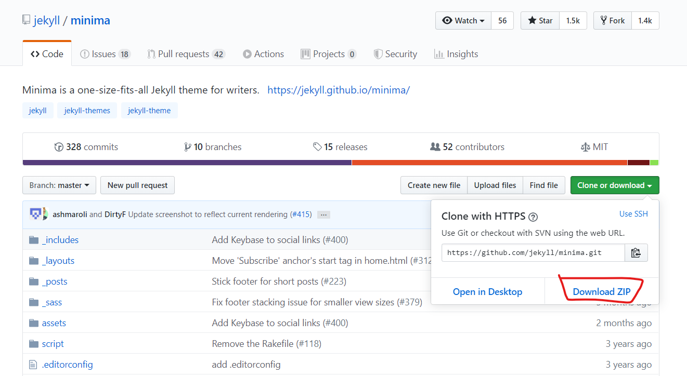

## 最简策略

### 初始化

1. [https://pages.github.com/](https://pages.github.com/) 按照网站所示建一个工程

2. [https://pages.github.com/themes/](https://pages.github.com/themes/)  挑一个喜欢的主题
   
   - 推荐主题  [https://jekyll.github.io/minima/](https://jekyll.github.io/minima/)  改改就能用
   
3. 下载选好的主题工程

   

4. pull 你的工程，清掉 .git 以外的文件，将主题工程解压复制过来，add、commit、push
5. 初步搞定。 

### 结构简介

1. 详细阅读  [http://jekyllcn.com/docs/structure/](http://jekyllcn.com/docs/structure/)   之后按照你的需求更改页面上的信息。

2. 在 `_post` 文件夹中创建格式为 ` 年-月-日-标题.md ` 的文件，添加YAML头信息，例如

   ```
   ---
   layout: post
   title: Blogging Like a Hacker
   ---
   ```

3. 添加内容

4. 至此一篇博客就写好了，push上去会自动排版。

## 折腾记录（持续更新）

### Ubuntu 安装 Jekyll 并初始化

1.  [http://jekyllcn.com/docs/installation/](http://jekyllcn.com/docs/installation/) 缺啥补啥。不推荐在 Windows 上安装，各种坑谁踩谁难受。

2.  `jekyll -v`  验证安装。

3.  新建工程 `jekyll new demo`

   ```shell
   jekyll new demo
   cd demo
   jekyll b
   jekyll s
   ```


### 图片策略

todo

### 样式修改

todo

### 标签管理

todo